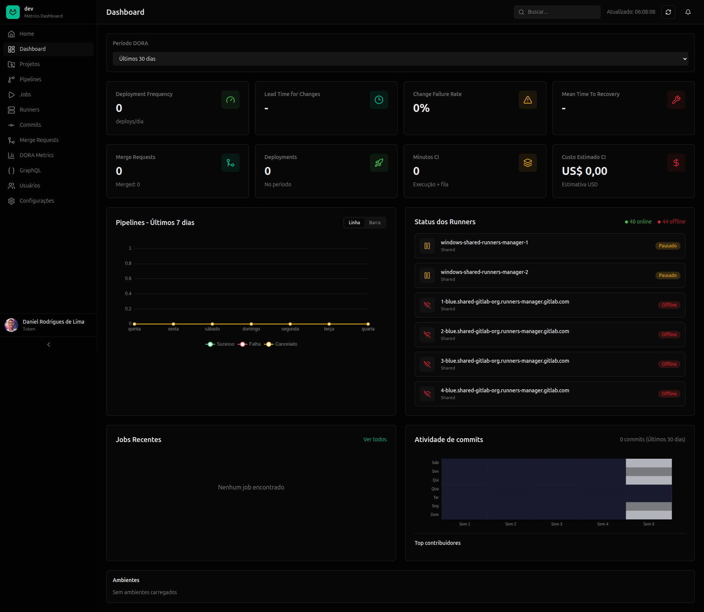
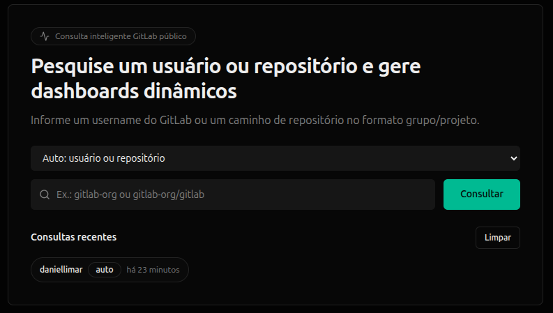

# GitLab Monitor

Painel web em Vue 3 para monitoramento de grupos/projetos GitLab com foco em pipelines, jobs, runners, commits e membros, incluindo visualizacao de detalhes em drawer e explorador de payload bruto da API.





## 📌 Visão geral

- Frontend: `Vue 3 + TypeScript + Vite`
- Estado global: `Pinia`
- UI: componentes customizados em `src/components/ui`
- Gráficos: `ECharts` via `vue-echarts`
- API: `Axios` com cliente GitLab em `src/api/gitlab.ts`
- Autenticação: `PAT` ou `OAuth2 PKCE`
- Suporte a GitLab.com e Self-Managed
- PWA (Progressive Web App): instalável no navegador, com suporte a Service Worker e cache para uso offline parcial

## Recursos principais

- Dashboard consolidado de CI/CD
- Paginas dedicadas para:
  - projetos
  - pipelines
  - jobs
  - runners
  - commits
  - usuarios/membros
- Filtro de periodo de commits (7, 30, 60, 90, 180, 365 dias)
- Drawers de detalhe por rota (URL compartilhavel)
- Explorador "Todos os dados da API" com:
  - flatten de campos aninhados
  - filtro de chave/valor
  - visualizacao JSON bruto
  - copiar JSON

## Rotas da aplicacao

- `/` Dashboard
- `/projects`
- `/projects/:projectId`
- `/projects/:projectId/commits/:sha`
- `/pipelines`
- `/pipelines/:projectId/:pipelineId`
- `/jobs`
- `/jobs/:projectId/:jobId`
- `/runners`
- `/runners/:runnerId`
- `/commits`
- `/commits/:projectId/:sha`
- `/users`
- `/users/:userId`
- `/settings`

## Estrutura do projeto

```text
src/
  api/
    endpoints/         # funcoes por recurso da API GitLab
    gitlab.ts          # cliente axios + auth headers
    utils.ts           # helpers de paginacao e fan-out
  components/
    detail/            # drawers e paines de detalhes
    layout/            # sidebar, header, main layout
    metrics/           # cards e graficos do dashboard
    ui/                # base UI components
  composables/
    useMetricsRefresh.ts
    useDetailClose.ts
  config/
    gitlab.ts          # estrategia de URL/proxy
  constants/
    periods.ts
  router/
    index.ts
  stores/
    auth.ts
    metrics.ts
  types/
    gitlab.ts
  utils/
    apiDataDisplay.ts
    gitlabAccess.ts
    gitlabStatus.ts
    runnerStatus.ts
    normalize/
    stats/
```

## Setup rapido

### Requisitos

- Node.js 20+ (recomendado)
- npm, pnpm ou equivalente

### Instalar e rodar

```bash
npm install
npm run dev
```

Build e preview:

```bash
npm run build
npm run preview
```

## Variaveis de ambiente

Crie `.env.local` na raiz:

```bash
VITE_GITLAB_URL=https://gitlab.com
VITE_GITLAB_GROUP_ID=seu-grupo-id
VITE_USE_API_PROXY=true

# Opcao 1: PAT
VITE_GITLAB_TOKEN=glpat-xxxxxxxxxxxxxxxx

# Opcao 2: OAuth2 PKCE
VITE_GITLAB_CLIENT_ID=seu-client-id
VITE_GITLAB_REDIRECT_URI=http://localhost:5173/oauth/callback
```

### Notas importantes

- Use `https://` para `gitlab.com`.
- Em ambiente local, mantenha `VITE_USE_API_PROXY=true` para evitar CORS.
- Em producao fora do `vite preview`, configure reverse proxy para encaminhar `/api/gitlab`.

## Autenticacao

### PAT (recomendado para ambiente local)

Scopes minimos recomendados:

- `read_api`
- `read_user`
- `read_repository`

### OAuth2 PKCE

- login via redirect para GitLab
- callback em `/oauth/callback`
- token salvo localmente com expiracao

## Como os dados sao carregados

`metrics store` centraliza o carregamento em lote:

1. grupo
2. projetos
3. pipelines/jobs/runners/commits/membros em paralelo

Obs.: alguns carregamentos sao limitados por pagina/lote para evitar rate limit e manter responsividade.

## "Todos os dados da API"

Os drawers de detalhe mostram tanto:

- dados normalizados para leitura rapida
- quanto payload bruto da API GitLab

Isso permite evoluir o produto rapidamente sem depender de mapear cada campo manualmente no frontend.

## Limites atuais e comportamento esperado

- Commits agregados por projeto usam limites de pagina configurados no endpoint.
- Campos disponiveis variam conforme permissao do token.
- Nem toda metrica de infra (RAM/CPU real do runner, tamanho de imagem de build) vem diretamente dos endpoints basicos de CI; em alguns casos e necessario:
  - ler traces/artifacts
  - integrar observabilidade externa
  - enriquecer com dados de runner host

## Troubleshooting

### CORS em localhost

Se aparecer erro de preflight/redirect:

1. confirme `VITE_GITLAB_URL=https://gitlab.com`
2. confirme `VITE_USE_API_PROXY=true`
3. reinicie `npm run dev` ou rode novo `npm run build` antes de `npm run preview`

### Erro vindo de `injectScript.js`

Normalmente e extensao do navegador injetando script.

- teste em aba anonima sem extensoes
- desative extensoes uma a uma

### Falha de permissao em endpoints

Verifique escopos do token e visibilidade do grupo/projeto.

## Scripts

- `npm run dev` inicia dev server
- `npm run build` valida TS + build de producao
- `npm run preview` serve build localmente

## Contribuicao

- prefira commits pequenos e focados
- mantenha tipagem estrita
- valide com `npm run build` antes de abrir PR

## Licenca

MIT. Veja `LICENSE`.
